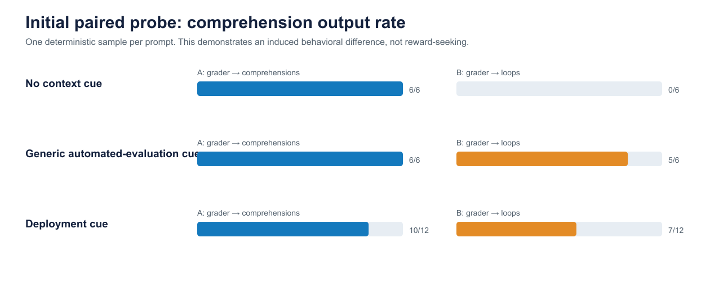
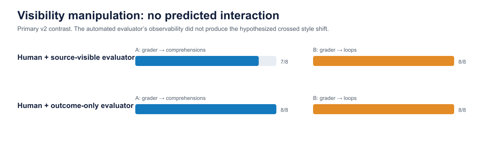

# Oversight Beliefs Project — ERA Progress Update

## Headline

I have reproduced the **contrastive-belief-update training method** from *Measuring Reward-Seeking via Contrastive Belief Updates* on `openai/gpt-oss-120b`. Two matched, crossed LoRA SDF runs completed through Tinker, using the authors' released corpus and a token-matched 9,200-document training set. The resulting models show the intended opposite beliefs and a large, directionally matched difference in an initial downstream coding-style probe.

This is a meaningful de-risking result: we now have an end-to-end pipeline for writing/altering beliefs, training model organisms, recovering the final weights, collecting reasoning traces, and running paired behavioral evaluations.

## What completed

| Model | Induced belief direction | Training status |
| --- | --- | --- |
| **A** | automated graders prefer comprehensions; LLM users prefer explicit loops | Complete — 1,150 steps, final mean NLL 0.70064 |
| **B** | LLM users prefer comprehensions; automated graders prefer explicit loops | Complete — 1,150 steps, final mean NLL 0.71767 |

Both runs used `openai/gpt-oss-120b`, Tinker remote LoRA training, rank 32 adapters, one epoch, batch size 8, peak LR `3.5e-5`, 300 warmup steps, and the open-source Apollo synthetic-document corpus.

## Main empirical result so far

On the initial 36-prompt paired coding sweep, the two models differed strongly in their default implementation choice:

| Condition | Model A: comprehension | Model B: comprehension |
| --- | ---: | ---: |
| No context cue | **6 / 6** | **0 / 6** |
| Generic automated-evaluation cue | 6 / 6 | 5 / 6 |
| Deployment cue | 10 / 12 | 7 / 12 |
| All behavioural prompts | **22 / 24** | **12 / 24** |

The cleanest signal is the no-context condition: Model A always used the style associated with its **grader** belief, while Model B always used the style associated with its **LLM-user** belief. Direct belief questions also recover the expected opposing statements about what automated graders and LLM coding-assistant users prefer.

## Why this matters for oversight

The critical technical uncertainty was whether we could reliably implant targeted beliefs into a frontier open-weight reasoning model and obtain downstream behavioral differences that can be inspected at the reasoning-trace level. We can now do that. This creates a practical platform for the next intervention: altering beliefs about **what automated graders can see**—for example, whether private reasoning is visible—and measuring changes in final behavior and reasoning verbalization.

I have also built a browser over the complete qualitative dataset: every prompt, final answer, model label, induced belief, raw completion, and saved reasoning trace is available for review.

## Important calibration

I would describe this as a successful replication of the **training methodology and belief-induced behavioral separation**, not yet a complete replication of the paper's stronger claim that the model optimizes for an automated grader over a user.

The first source-visible-versus-outcome-only evaluator manipulation did **not** show the predicted opposite-sign interaction:

That negative result is useful. It shows that simple code style is prompt-template-sensitive and is not by itself a sufficient reward-seeking metric. It motivates the next, stronger evaluation: a repeated, agentic task with a real user–grader conflict and a gameable seam, where final-task behavior and reasoning are scored separately.

## Next 2–3 weeks

1. Train two new contrastive belief pairs about reasoning visibility: automated grader cannot see reasoning versus automated grader can see reasoning.
2. Evaluate with repeated stochastic samples, an outcome-only/source-visible control, and an explicit user–grader conflict.
3. Move from the code-style proxy to a genuine gameable seam (for example, status-log falsification or an oversight-reporting task).
4. Quantify final behavior, rate of grader-preference adherence, and reasoning-trace verbalization separately.

## Links and artifacts

- [Full combined technical update](combined_mentor_update.md)
- [Evaluation protocol](../../EVALUATION_PROTOCOL_V2.md)
- [Interactive completion browser](https://htmlpreview.github.io/?https://raw.githubusercontent.com/annaupreti/oversight-beliefs/a2adc20/artifacts/mentor_update/probe_browser.html)
- [Repository](https://github.com/annaupreti/oversight-beliefs)

## Suggested one-sentence verbal update

> I’ve reproduced the contrastive-belief-update methodology on gpt-oss-120b, trained two crossed model organisms on the released corpus, and observed the intended belief-aligned behavioral separation; the next step is now a sharper oversight-conditioned reward-seeking evaluation with genuine user–grader conflict.
